# 📚 Gravity Bookstore Data Warehouse Project

[](#sql-server)
[](#ssis-etl)
[](#ssas-olap)
[](#power-bi)
[](#data-warehouse-modeling)

Welcome to the **Gravity Bookstore Data Warehouse Project** repository.  
This project presents a complete end-to-end **Business Intelligence / Data Warehouse solution** for the **Gravity Bookstore** database using **SQL Server**, **SSIS**, **SSAS**, and **Power BI**.

The main goal of this project is to transform operational bookstore data into a clean, well-modeled analytical data warehouse, build OLAP cubes for multidimensional analysis, and design interactive Power BI dashboards to monitor sales performance and order status insights.

---

## 📌 Project Overview

The project follows a complete BI workflow:

1. **Data Warehouse Modeling**  
   Designed a dimensional model using fact tables, dimension tables, and a bridge table to support analytical reporting.

2. **Data Warehouse Creation in SSMS**  
   Created the data warehouse database and tables using SQL Server scripts.

3. **ETL Development Using SSIS**  
   Built SSIS packages to extract data from the source database, apply transformations, handle Slowly Changing Dimensions, and load the data warehouse.

4. **OLAP Cube Development Using SSAS**  
   Created multidimensional cubes and dimensions to enable fast analytical queries and business slicing.

5. **Dashboard Development Using Power BI**  
   Designed interactive dashboards for sales performance, order status tracking, top books, authors, publishers, customers, and shipping analysis.

---

## 🏗️ End-to-End Architecture

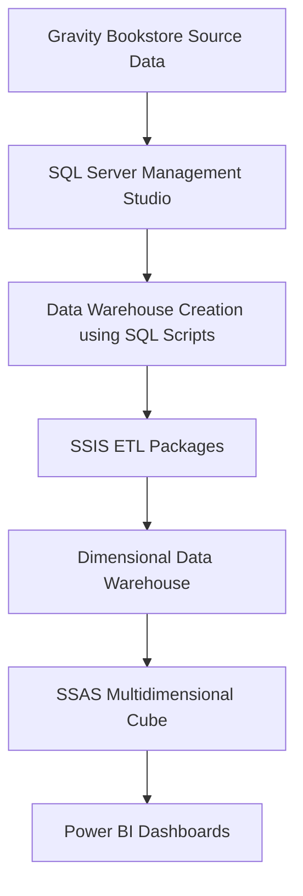
```mermaid
flowchart TD
    A[Gravity Bookstore Source Data] --> B[SQL Server Management Studio]
    B --> C[Data Warehouse Creation using SQL Scripts]
    C --> D[SSIS ETL Packages]
    D --> E[Dimensional Data Warehouse]
    E --> F[SSAS Multidimensional Cube]
    F --> G[Power BI Dashboards]
```

---

## 🛠️ Tools & Technologies

| Tool | Purpose |
|---|---|
| **SQL Server** | Store source data and data warehouse tables |
| **SSMS** | Create and manage the data warehouse database |
| **T-SQL** | Create tables, constraints, date dimension, and warehouse scripts |
| **SSIS** | Build ETL packages for extracting, transforming, and loading data |
| **SSAS** | Build multidimensional OLAP cubes and measures |
| **Power BI** | Create analytical dashboards and business reports |
| **Visual Studio** | Develop SSIS packages and SSAS cube project |
| **GitHub** | Version control and project documentation |

---

<a id="data-warehouse-modeling"></a>

## 🧩 Data Warehouse Modeling

The data warehouse was designed using a dimensional model that supports both sales analysis and order status analysis.

### Data Warehouse Schema

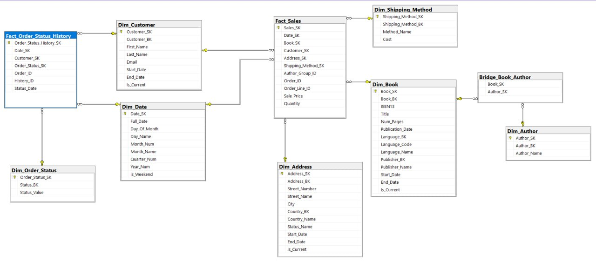

### Main Design Concepts

- **Fact tables** store measurable business events.
- **Dimension tables** store descriptive business attributes.
- **Bridge table** handles the many-to-many relationship between books and authors.
- **Slowly Changing Dimension Type 2** is applied to selected dimensions to keep historical changes.
- **Date Dimension** supports time-based reporting by day, month, quarter, and year.

---

<a id="star-schema"></a>

## ⭐ Dimensional Model

### Fact Tables

#### 1. `Fact_Sales`
Stores sales transaction details at the order-line level.

**Grain:** One row per sold book/order line.

Main columns include:
- `Sales_SK`
- `Date_SK`
- `Book_SK`
- `Customer_SK`
- `Address_SK`
- `Shipping_Method_SK`
- `Author_Group_ID`
- `Order_ID`
- `Order_Line_ID`
- `Sale_Price`

#### 2. `Fact_Order_Status_History`
Stores the history of order status changes.

**Grain:** One row per order status change.

Main columns include:
- `Order_Status_History_SK`
- `Date_SK`
- `Customer_SK`
- `Order_Status_SK`
- `Order_ID`
- `History_ID`
- `Status_Date`

---

### Dimension Tables

| Dimension | Description |
|---|---|
| `Dim_Date` | Calendar information such as day, month, quarter, year, and weekend flag |
| `Dim_Book` | Book details, ISBN, title, language, publisher, and publication date |
| `Dim_Author` | Author information |
| `Dim_Customer` | Customer details with SCD Type 2 tracking |
| `Dim_Address` | Customer address and country information with SCD Type 2 tracking |
| `Dim_Shipping_Method` | Shipping method and cost |
| `Dim_Order_Status` | Order status values such as delivered, cancelled, pending, and returned |
| `Bridge_Book_Author` | Bridge table between books and authors |

---

<a id="sql-server"></a>

## 🗄️ SQL Server Data Warehouse Implementation

The warehouse database was created in **SQL Server Management Studio** using T-SQL scripts.

### Main SQL Scripts

| Script | Description |
|---|---|
| `SQL/Query_create_DWH.sql` | Creates the Gravity Books data warehouse database and core tables |
| `SQL/query_dim_date.sql` | Populates the `Dim_Date` table from 2000 to 2030 |

### Data Warehouse Creation Steps

1. Created a new database named `gravity_books_DWH`.
2. Created dimension tables.
3. Created bridge table for book-author relationships.
4. Created fact tables for sales and order status history.
5. Added primary keys and foreign key relationships.
6. Loaded the Date Dimension using a custom T-SQL script.
7. Adjusted column data types where needed to match SSIS source metadata.

---

<a id="ssis-etl"></a>

## 🔄 ETL Process Using SSIS

SSIS was used to extract data from the source bookstore database and load it into the dimensional data warehouse.

Each dimension and fact table has a dedicated SSIS package. The packages include **Control Flow** and **Data Flow** tasks.

### General SSIS Package Flow

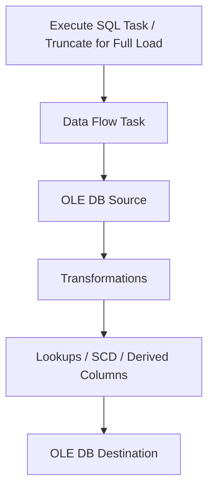
```mermaid
flowchart TD
    A[Execute SQL Task / Truncate for Full Load] --> B[Data Flow Task]
    B --> C[OLE DB Source]
    C --> D[Transformations]
    D --> E[Lookups / SCD / Derived Columns]
    E --> F[OLE DB Destination]
```

### SSIS Components Used

- **Execute SQL Task** for preparing target tables during full load.
- **OLE DB Source** to read data from the source database.
- **OLE DB Destination** to load data into the data warehouse.
- **Slowly Changing Dimension** for historical tracking.
- **Derived Column** for adding or adjusting calculated fields.
- **Lookup Transformation** to replace business keys with surrogate keys.
- **Union All** to combine multiple ETL outputs.
- **OLE DB Command** to update historical records when using SCD Type 2.

---

## 📦 SSIS Packages

### Dimension Packages

| Package | Main Purpose |
|---|---|
| `data_flow_dim_date` | Load the Date Dimension from generated SQL date records |
| `data_flow_dim_author` | Load author information |
| `data_flow_dim_book` | Load book, language, and publisher information |
| `data_flow_bridge_book_author` | Load the many-to-many relationship between books and authors |
| `data_flow_dim_customer` | Load customer information using SCD Type 2 |
| `data_flow_dim_address` | Load address and country information using SCD Type 2 |
| `data_flow_dim_shipping_method` | Load shipping method details |
| `data_flow_dim_order_status` | Load order status values |

### Fact Packages

| Package | Main Purpose |
|---|---|
| `data_flow_fact_sales` | Load sales transactions and map dimension surrogate keys |
| `data_flow_fact_order_status_history` | Load order status history and map related dimensions |

---

## 🖼️ SSIS Screenshots

All SSIS package screenshots are stored under:

```text
SSIS/screenshots/
```

<details>
<summary><strong>View SSIS Package Screenshots</strong></summary>

### Bridge Book Author - Control Flow
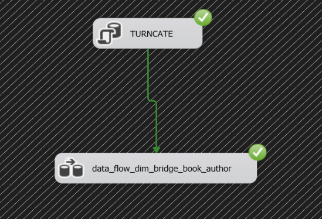

### Bridge Book Author - Data Flow
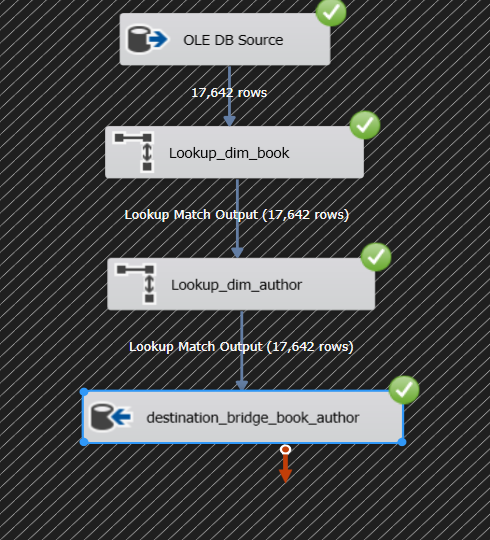

### Dim Address - Control Flow


### Dim Address - Data Flow
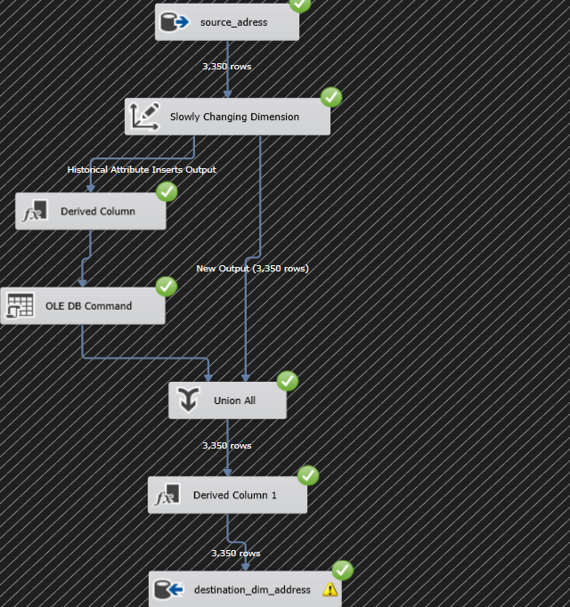

### Dim Author - Control Flow
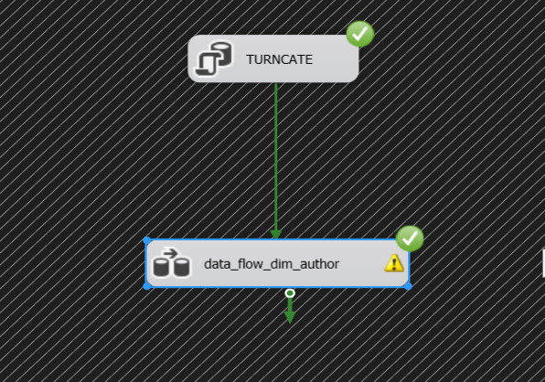

### Dim Author - Data Flow
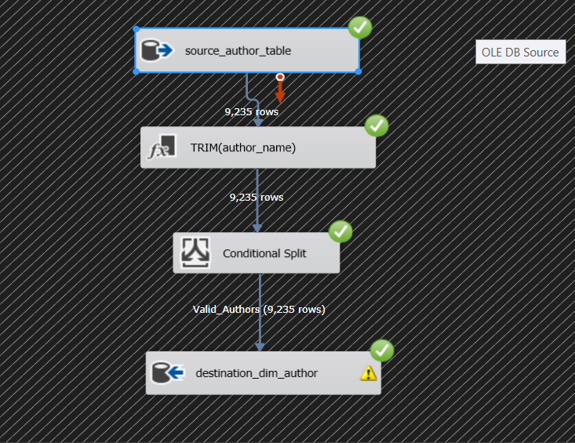

### Dim Book - Control Flow
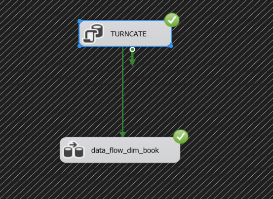

### Dim Book - Data Flow
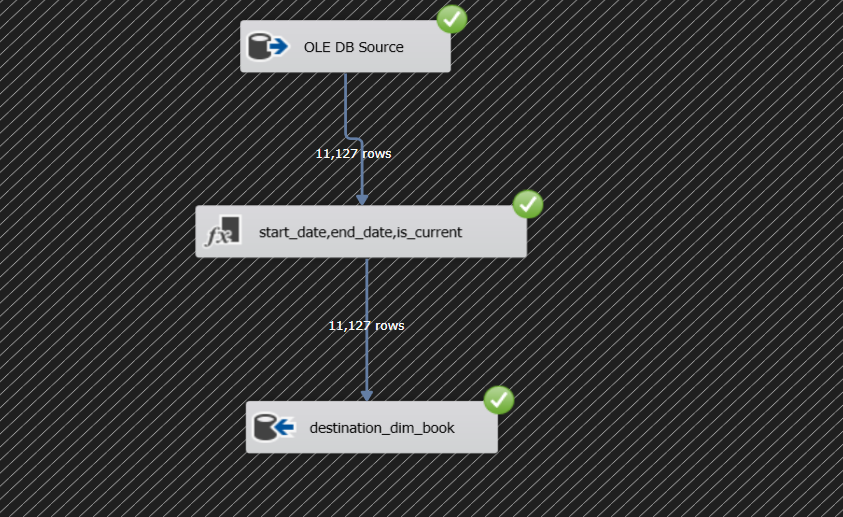

### Dim Customer - Control Flow
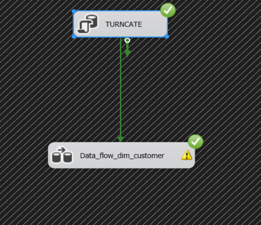

### Dim Customer - Data Flow
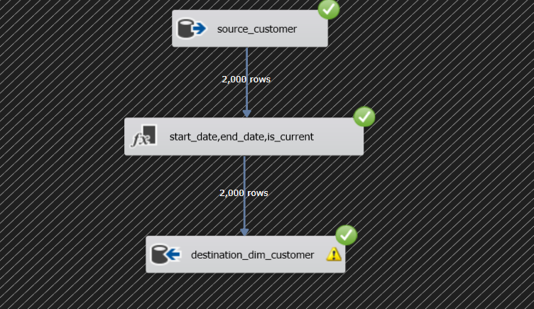

### Dim Order Status - Control Flow
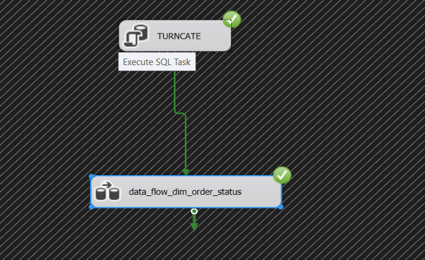

### Dim Order Status - Data Flow
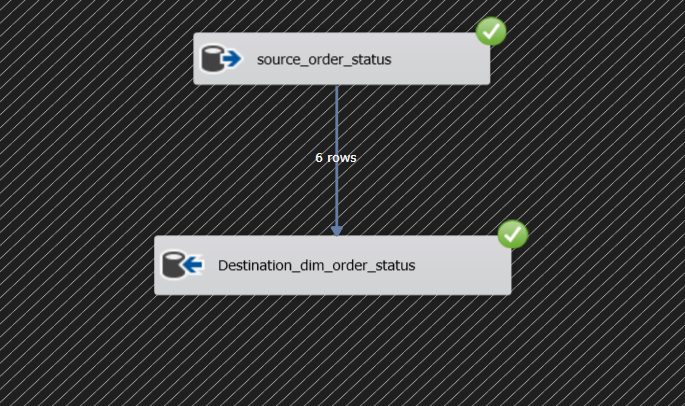

### Dim Shipping Method - Control Flow
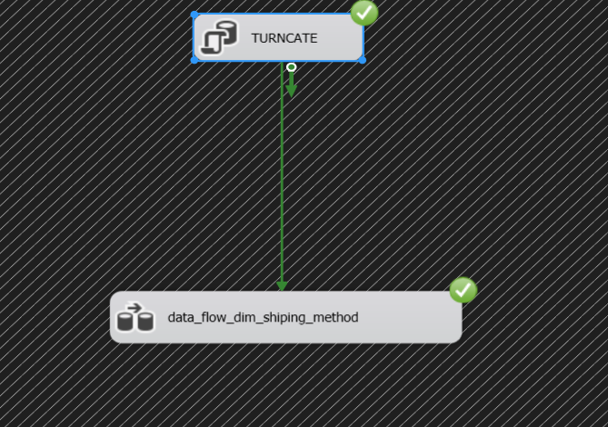

### Dim Shipping Method - Data Flow
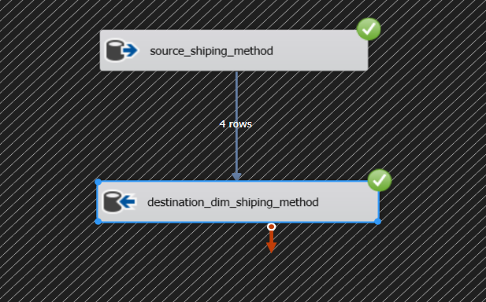

### Fact Sales
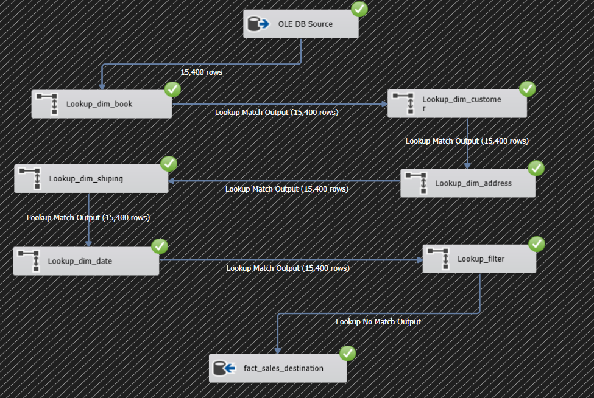

### Fact Order Status History
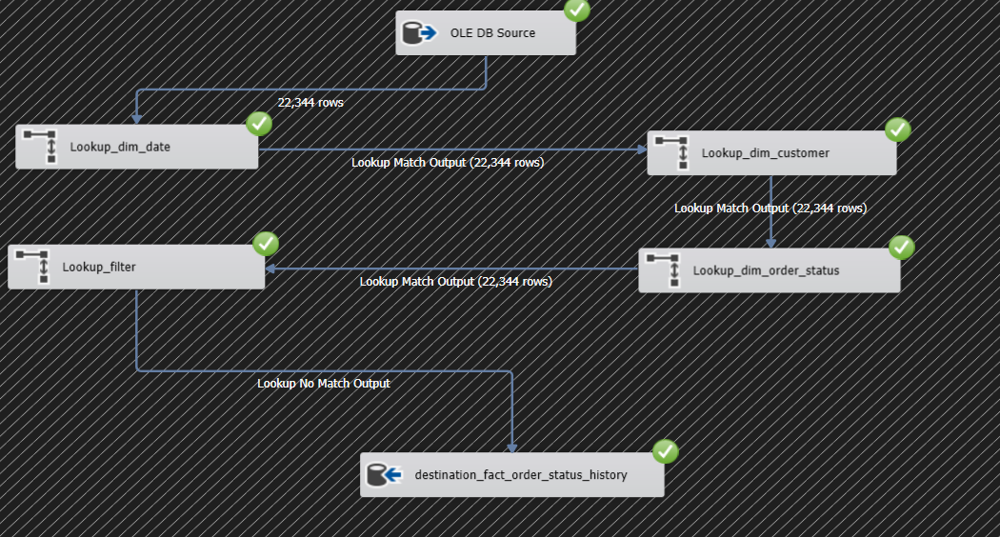

</details>

---

<a id="ssas-olap"></a>

## 🧊 OLAP Cube Development Using SSAS

After loading the dimensional data warehouse, an SSAS multidimensional cube was created to enable fast and flexible analytical reporting.

### SSAS Development Steps

1. Created an SSAS Multidimensional project in Visual Studio.
2. Created a Data Source connection to `gravity_books_DWH`.
3. Created a Data Source View using the warehouse tables.
4. Created dimensions for Date, Book, Customer, Address, Shipping Method, and Order Status.
5. Created measure groups from fact tables.
6. Defined relationships in the Dimension Usage tab.
7. Created calculated measures such as average sales.
8. Processed the cube and browsed the results.

### Cube Dimensions

- `Dim Date`
- `Dim Book`
- `Dim Customer`
- `Dim Address`
- `Dim Shipping Method`
- `Dim Order Status`

### Cube Measure Groups

| Measure Group | Measures |
|---|---|
| `Fact Sales` | Sales Count, Sale Price, Average Sales |
| `Fact Order Status History` | Order Status History Count |

---

## 🖼️ SSAS Cube Screenshots

All SSAS screenshots are stored under:

```text
SSAS/Screenshots/
```

<details>
<summary><strong>View SSAS Cube Screenshots</strong></summary>

### Gravity Books Cube
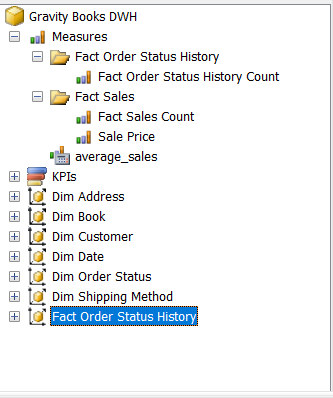

### Cube Structure
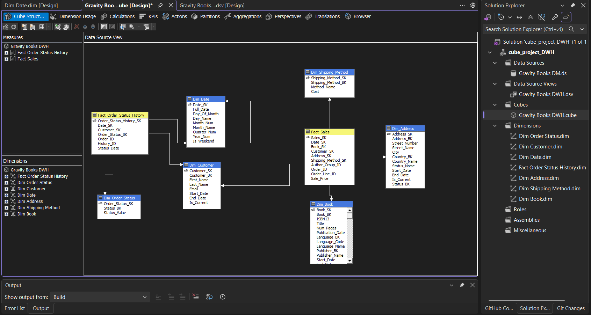

### Cube Browser - Address Analysis
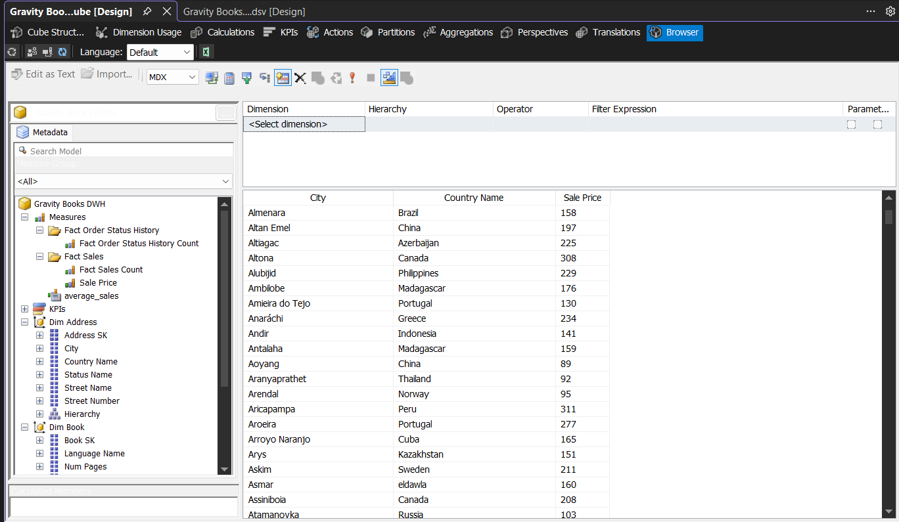

### Cube Browser - Book Analysis
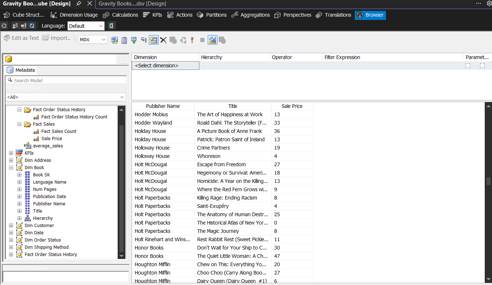

### Cube Browser - Customer Analysis
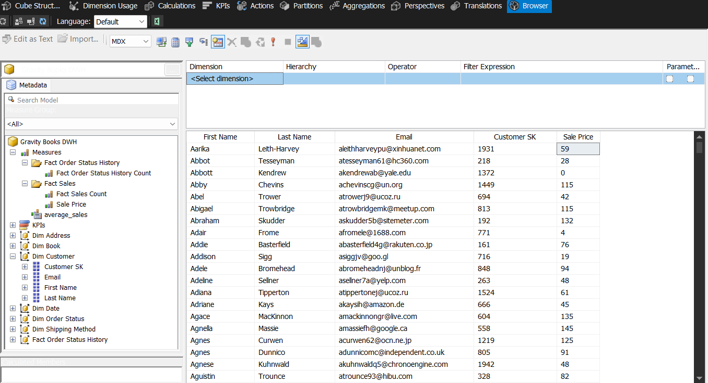

### Cube Browser - Order Status Analysis
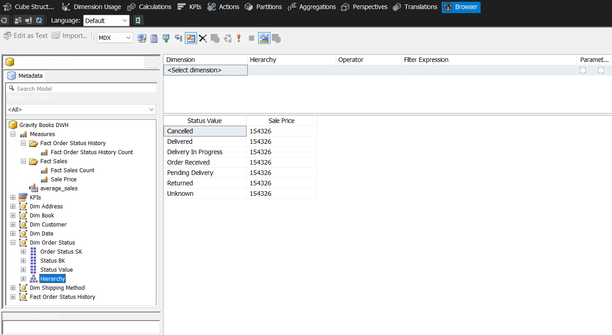

### Cube Browser - Shipping Method Analysis
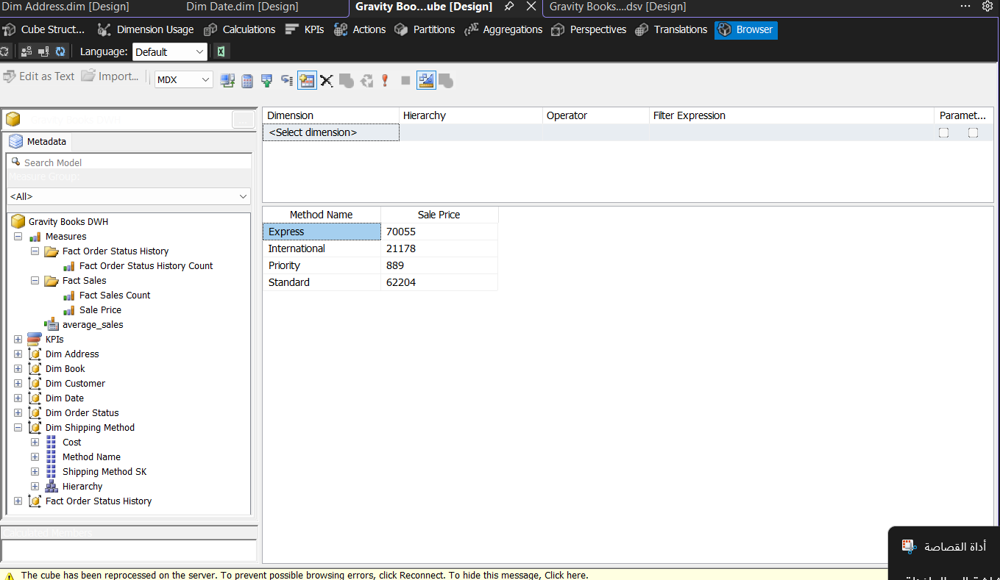

</details>

---

<a id="power-bi"></a>

## 📊 Power BI Dashboards

Power BI was used to create interactive business dashboards connected to the analytical model.

The dashboards focus on two main areas:

1. **Sales Performance Analysis**
2. **Order Status Analysis**

---

## 📈 Dashboard 1: Sales Performance

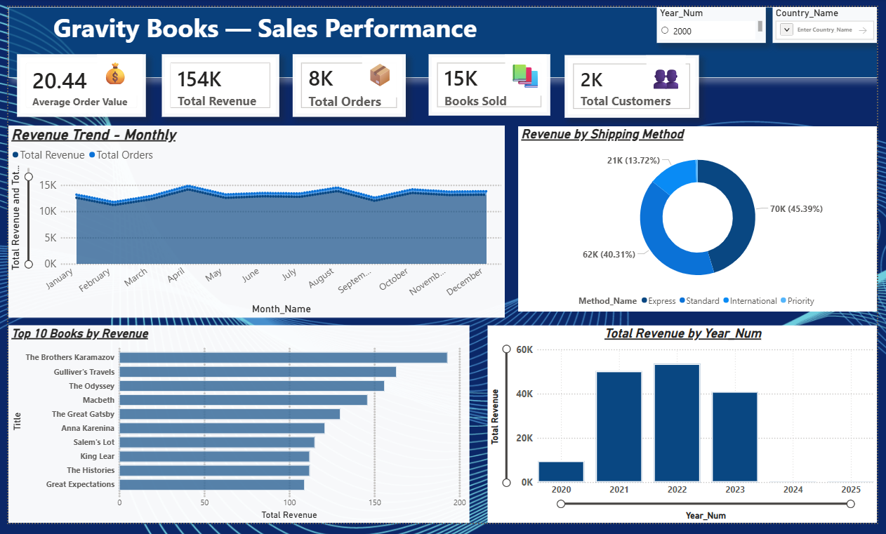

### Main KPIs

- **Average Order Value**
- **Total Revenue**
- **Total Orders**
- **Books Sold**
- **Total Customers**

### Visuals Included

- Revenue Trend by Month
- Revenue by Shipping Method
- Top 10 Books by Revenue
- Total Revenue by Year
- Year slicer
- Country slicer

### Business Questions Answered

- What is the total revenue generated by the bookstore?
- Which books generate the highest revenue?
- Which shipping methods contribute most to revenue?
- How does revenue change over months and years?
- Which countries contribute to sales performance?

---

## 📦 Dashboard 2: Order Status Analysis

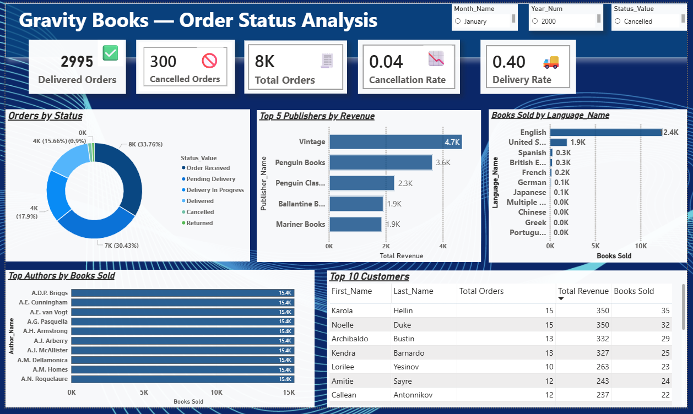

### Main KPIs

- **Delivered Orders**
- **Cancelled Orders**
- **Total Orders**
- **Cancellation Rate**
- **Delivery Rate**

### Visuals Included

- Orders by Status
- Top 5 Publishers by Revenue
- Books Sold by Language
- Top Authors by Books Sold
- Top 10 Customers
- Month slicer
- Year slicer
- Status slicer

### Business Questions Answered

- How many orders were delivered, cancelled, returned, or still pending?
- What is the cancellation rate?
- What is the delivery rate?
- Which publishers generate the highest revenue?
- Which authors sell the most books?
- Who are the top customers by revenue and number of orders?

---

## 📂 Repository Structure

```text
Gravity-Bookstore-Data_Warehouse_Project/
│
├── BowerBI/
│   ├── powerbi.pbix
│   └── dashboard/
│       ├── BowerBI_dashboard_sales_performance.png
│       └── BowerBI_dashboard_order_status_analysis.png
│
├── Modeling/
│   └── modeling_DWH.jpg
│
├── SQL/
│   ├── Query_create_DWH.sql
│   └── query_dim_date.sql
│
├── SSAS/
│   ├── SSAS cube project files
│   └── Screenshots/
│
├── SSIS/
│   ├── SSIS packages
│   └── screenshots/
│
├── source_data/
│   └── Gravity Bookstore source data
│
├── LICENSE
└── README.md
```

---

## 🚀 How to Run the Project

### 1. Prepare SQL Server Source Data

- Open SQL Server Management Studio.
- Restore or create the Gravity Bookstore source database.
- Make sure the source tables are available before running SSIS packages.

### 2. Create the Data Warehouse

Run the following scripts in SSMS:

```sql
Query_create_DWH.sql
query_dim_date.sql
```

This will create and populate the required data warehouse tables.

### 3. Run SSIS ETL Packages

Open the SSIS solution in Visual Studio and run the packages in the correct order:

1. Dimensions
2. Bridge table
3. Fact tables

Recommended loading order:

```text
Dim_Date
Dim_Author
Dim_Book
Bridge_Book_Author
Dim_Customer
Dim_Address
Dim_Shipping_Method
Dim_Order_Status
Fact_Sales
Fact_Order_Status_History
```

### 4. Process the SSAS Cube

- Open the SSAS project in Visual Studio.
- Check the Data Source connection.
- Deploy the project.
- Process dimensions and cube.
- Browse the cube to validate the results.

### 5. Open Power BI Dashboards

- Open the Power BI report file.
- Update the data source connection if needed.
- Refresh the dashboard.
- Use slicers and visuals to explore the business insights.

---

## ✅ Key Features

- Complete BI workflow from source data to dashboards.
- Dimensional modeling using fact and dimension tables.
- Star schema / galaxy schema design.
- Bridge table for many-to-many relationship between books and authors.
- SCD Type 2 implementation for historical tracking.
- SSIS ETL packages for dimensions and facts.
- SSAS multidimensional cube for OLAP analysis.
- Power BI dashboards with KPIs, slicers, and interactive visuals.
- Clean GitHub repository structure with documentation and screenshots.

---

## 📌 Business Insights Provided

This project helps analyze:

- Total revenue and sales trends.
- Top-selling books and authors.
- Top publishers by revenue.
- Customer purchasing behavior.
- Revenue by country and shipping method.
- Order delivery, cancellation, pending, and return status.
- Monthly and yearly sales performance.

---

## 🎯 Skills Demonstrated

- Data Warehouse Design
- Dimensional Modeling
- Star Schema and Galaxy Schema
- SQL Server Development
- T-SQL Scripting
- SSIS ETL Development
- Slowly Changing Dimensions
- Surrogate Key Mapping
- SSAS Cube Development
- OLAP Analysis
- Power BI Dashboard Design
- Business Intelligence Reporting
- GitHub Project Documentation

---

## 🔮 Future Enhancements

- Add incremental loading instead of full refresh for all packages.
- Add more advanced DAX measures in Power BI.
- Add drill-through pages for customer and book-level analysis.
- Add data quality validation reports.
- Automate ETL execution using SQL Server Agent.
- Add deployment documentation for SSIS and SSAS.

---

## 🌟 About Me

Hi, I'm **Gehad Hany Elsayed**, a Computer and Data Science graduate from Alexandria University.  
I’m passionate about **Data Engineering**, **ETL pipelines**, **Data Warehousing**, and **Business Intelligence solutions**.

I enjoy designing data models, building ETL pipelines, creating analytical cubes, and transforming raw data into clear business insights through dashboards.

[](https://www.linkedin.com/in/gehad-hani-36602a261)

---

## 📄 License

This project is licensed under the **MIT License**.
